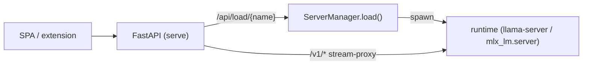

# Architecture

A UI-agnostic core (catalog + library + runtime) with thin frontends (CLI, web
API/SPA) on top. Everything is **Pydantic** — settings via pydantic-settings,
and every data type is a `BaseModel` (no `@dataclass`).

## Modules

```
src/kodo/
├── config.py    # Settings (KODO_* env vars; backup_root, serve_ui, …)
├── models.py    # ModelSource, ModelFormat, ModelEntry, Catalog, PullResult
├── catalog.py   # list/pull across the source stores
├── library.py   # scan the on-drive library → LibraryModel (+ load_target, mmproj)
├── runtime.py   # build run/chat/generate commands (llama.cpp / mlx_lm)
├── server.py    # ServerManager: one runtime child process + lifecycle
├── cards.py     # model-card + metadata sidecars
├── cli.py       # Typer app: list / library / pull / run / chat / serve
├── app.py       # FastAPI factory (CORS, routers, SPA mount, lifespan)
├── routers/     # health, catalog (browse/pull), serving (status/load/proxy)
└── sources/     # base + huggingface / ollama / lmstudio adapters
```

## Two views of "models"

- **Sources** (`catalog` + `sources/`) — what's in the local HF cache, Ollama,
  and LM Studio stores; the candidates for `kodo pull`.
- **Library** (`library`) — what's on the drive under `backup_root`; the
  runnable set. `LibraryModel` carries `load_target` (the exact file/dir to hand
  the runtime) and `mmproj` (multimodal projector, if any).

## Serving

`serve` runs FastAPI. A `ServerManager` owns at most one runtime child process
(`llama-server` / `mlx_lm.server`) on an internal `runtime_port`. The
`serving` router exposes `/api/status`, `/api/load/{name}`, and a streaming
`/v1/{path}` proxy, so the browser SPA (and the future extension) talk to one
stable origin while the underlying model is swapped underneath.



## Runtimes

- **GGUF → llama.cpp** (`llama-server`, `llama-cli`) — cross-platform, web UI,
  tool calling (`--jinja`), and a native router mode for hot-swap.
- **MLX → mlx_lm** (`mlx_lm.server`, `mlx_lm.chat`, `mlx_lm.generate`) — Apple
  Silicon.

Command names are pinned to current upstream (verified mid-2026). See the
[CLI reference](cli.md) for the command surface.
