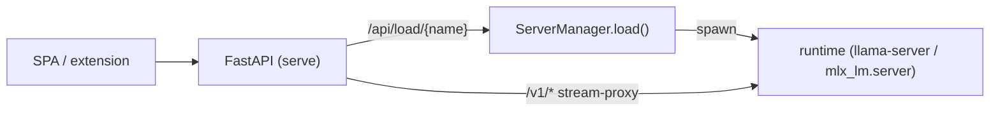

# Architecture

A UI-agnostic core (catalog + library + runtime) with thin frontends (CLI, web
API/SPA) on top. Everything is **Pydantic** — settings via pydantic-settings,
and every data type is a `BaseModel` (no `@dataclass`).

## Modules

Large concerns are **packages** (a re-exporting `__init__` keeps `from kodo import X` working while
the internals live in focused submodules); small cross-cutting modules stay top-level.

```
src/kodo/
├── config.py / userconfig.py  # Settings (kodo.toml + KODO_* env) + the durable machine config
├── models.py / host.py / locking.py / doctor.py  # core value types, OS helpers, per-library lock, health
├── cli/         # the Typer app, one module per command group (_app/_common + library/project/mcp/
│                #   voice/config/health/chat/serve) — was one 2400-line cli.py
├── library/     # scan the on-drive library → LibraryModel: _model, _roots, _scan, _manage
├── runtime/     # spawn + run models: runtime (commands), supervisor (reaper), serve_registry, sampling
├── voice/       # TTS/STT: kokoro, tts, the mlx-audio runtime, audio export, the voice registry
├── chat_tui/    # the Textual terminal chat: _util, _widgets, app (ChatApp)
├── project.py / scaffold.py / templates.py  # the kodo.toml manifest (one parser+writer) + scaffolding
├── agent.py / tools.py / mcpservers.py / mcp_catalog.py / plugins.py  # agent loop + MCP client/config
├── catalog.py / consumers.py / cards.py / tags.py / arch.py / capabilities.py  # source + library support
├── attach.py / chatui.py / hfcache.py  # media attach, shared chat rendering, HF-cache redirect
├── app.py / server.py  # FastAPI factory (CORS/auth/SPA/lifespan) + ServerManager (one runtime child)
├── routers/     # FastAPI routers: health, catalog (browse/pull), and serving/ (a package: _base/core/
│                #   chat/voice/proxy behind one APIRouter)
└── sources/     # base + huggingface / ollama / lmstudio adapters
```

## Two views of "models"

- **Sources** (`catalog` + `sources/`) — what's in the local HF cache, Ollama,
  and LM Studio stores; the candidates for `kodo library pull`.
- **Library** (`library`) — what's on the drive under `library_root`; the
  runnable set. `LibraryModel` carries `load_target` (the exact file/dir to hand
  the runtime) and `mmproj` (multimodal projector, if any).

A library is scanned per bucket — `voice/`, the format dirs (`gguf/` / `mlx/` / …), and Ollama's
native store each have their own layout — but a model's **identity** is a `ModelRef` (name +
format), not a bare name string: that's what `scan()` dedups on (the same model+format in two
libraries is one entry; a GGUF and an MLX build of the same repo are distinct and both survive).
Every bucket scanner funnels its per-item construction through one fault-isolation helper, so a
single corrupt or half-written model on disk is skipped rather than crashing the whole listing —
`scan()` returns the healthy models and never raises on a bad one.

## Serving

`serve` runs FastAPI. A `ServerManager` owns at most one runtime child process
(`llama-server` / `mlx_lm.server`) on an internal port — auto-picked free by
default, or pinned via `runtime_port` / `--runtime-port`. The
`serving` router exposes `/api/status`, `/api/load/{name}`, and a streaming
`/v1/{path}` proxy, so the browser SPA (and the future extension) talk to one
stable origin while the underlying model is swapped underneath.



## Runtimes

- **GGUF → llama.cpp** (`llama-server`, `llama-cli`) — cross-platform, web UI,
  tool calling (`--jinja`), and a native router mode for hot-swap.
- **MLX → mlx_lm** (`mlx_lm.server`, `mlx_lm.chat`, `mlx_lm.generate`) — Apple
  Silicon.

Command names are pinned to current upstream (verified mid-2026). See the
[CLI reference](cli.md) for the command surface.

## Configuration & the project manifest

`kodo.toml` is one file with **two readers, by design**:

- **Machine config** (`config.py`) — `library_root`, `host`/`port`, `cors_origins`,
  `auth_token`, and other per-machine settings. These are `pydantic-settings` fields, so any
  value can be overridden per machine with a `KODO_*` env var (precedence: CLI args > `KODO_*`
  env > `kodo.toml` > `.env` > `~/.config/kodo/config.toml`). `library_root` has **no default** —
  it is `None` when unset, and every consumer routes through `library.roots()` /
  `library.default_root()`, which raise `LibraryNotConfigured` rather than silently using `./data`.
- **The project manifest** (`project.py`) — the *portable, committable* assistant definition:
  `[project]` (model + system prompt), `[voice]`, and `libraries` (which stores this project
  composes, in priority order). Tools are separate — the standard `mcpServers` JSON in `.mcp.json`
  (`mcpservers.py`), merged with the machine-global `~/.config/kodo/mcp.json`. No machine-specific
  paths, so a project directory is git-committable and moves between machines.

Despite the two readers, the file has **one parser and one writer** (`project.py`):

- `project.read_raw()` is the single TOML parse. `config.py`'s settings source routes through it
  too, so a malformed `kodo.toml` fails one way — a clean `ProjectError` — instead of crashing
  differently in each reader.
- `project.render_manifest()` renders a fresh manifest from values (`kodo project init` / `new`);
  `project.add_mcp()` appends a server and **re-parses the result to validate before writing**,
  so an edit (`kodo mcp add`) can never leave a half-written or broken `kodo.toml` behind.

### Import-time HF cache (the one deliberate side effect)

`kodo/__init__.py` points the Hugging Face hub cache at `<library_root>/.cache/huggingface` **at
import time** (`hfcache.configure()`), so assets some runtimes fetch by repo id — e.g. mlx-audio's
Dia DAC codec — travel with the drive instead of landing in `~/.cache/huggingface`. This *must*
run before `huggingface_hub` is imported, because hf_hub freezes its cache path at its own import
— and importing almost any kodo module transitively imports hf_hub. It is best-effort and guarded:
a no-op if the user set `HF_HOME`/`HF_HUB_CACHE`, or there is no mounted, configured library. This
is the only intentional import-time side effect; everything else is lazy.

### Serve → worker config handoff

`kodo serve` passes its runtime config to the app through a small set of `KODO_*` env vars
(`_export_serve_env`). This env channel is deliberate: with `--reload`, uvicorn imports the app in
a *fresh subprocess* that has none of the CLI's in-process overrides, so env is the only thing
that crosses. Centralized in one documented function rather than scattered `os.environ` writes.

## Process lifecycle & concurrency

Model runtimes are **external processes** kodo spawns, and both the CLI (`runtime.start`) and the
server (`ServerManager`) go through one **supervisor** (`runtime/supervisor.py`):

- Each runtime is spawned in its own session (`start_new_session`), so stopping it `killpg`s the
  whole group — the runtime *and* any workers it forked, not just the direct child.
- Each records a `meta.json` (its pid/pgid/command + the pid of the kodo that owns it) under
  the XDG runtime/cache dir (`$XDG_RUNTIME_DIR/kodo/runtimes`, else `~/.cache/kodo/runtimes`) —
  ephemeral, machine-local state (a pid means nothing on another machine, so it deliberately
  does **not** live in a library). On a graceful exit an `atexit` hook stops live
  runtimes; for an ungraceful death (SIGKILL/OOM), `sweep_orphans()` runs at the next kodo start
  and reclaims a runtime whose owning kodo is gone (and whose live command still matches — a
  PID-reuse guard), so a crashed kodo never leaves a model holding memory with no way to reclaim it.
- The auto-picked runtime port is retried on a bind collision, closing the find-a-free-port race.

Because the CLI and `kodo serve` are expected to run **concurrently** against the same library,
mutations that read-modify-write shared files take a per-library advisory lock (`locking.py`, a
`flock` on `<root>/.kodo/lock`): tag edits and destructive removes can't lose each other's changes
across processes. Long-running pulls are intentionally not held under this lock (they stage into
distinct model dirs with an atomic final move).
