# Chrome side panel

The stabbur **side panel** puts your local model — and its tools — next to every page
you browse. It is a thin Chrome MV3 client for a running `sb serve`: stabbur owns the
model, the agent loop, and the MCP tools; the panel just renders the chat and streams
the answer. It is the same chat UI the web app ships (one SPA, wrapped as a side
panel), so Markdown, code highlighting, and tool-call chips all behave identically.

<figure markdown>
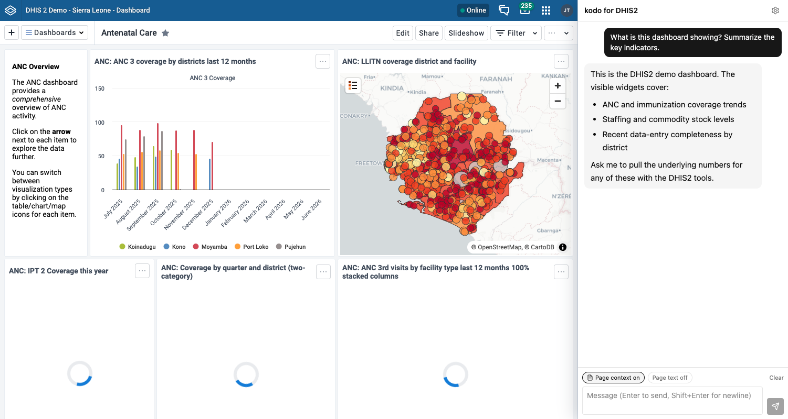
<figcaption>The panel sits beside whatever you are looking at — here a live DHIS2
dashboard — with page context on so your question is grounded in the page.</figcaption>
</figure>

It works with **any** stabbur backend:

- a **generic** `sb serve` (pick-a-model free-play, or a locked single model), or
- a **project assistant** — a `stabbur.toml` with an `[assistant]` block, such as the
  [`dhis2` template](projects.md#templates) — which adds the target banner, session
  probes, and the "Use my login" bind flow shown below.

For copy-paste prompts that are verified to work well with a ~12B local model, see the
[Chrome side-panel prompt catalog](extension-prompts.md).

## Install

The panel is built from the repo, then loaded unpacked (it is not on the Chrome Web
Store yet).

**Two builds, one codebase.** The same source ships in two flavors: the generic
**stabbur** panel and **stabbur for DHIS2** (a DHIS2-branded name, description, and icon,
plus DHIS2-oriented connection copy). Every feature is in both — only the wording
differs. Build whichever you want (or both):

```bash
make extension                     # generic -> extension/.output/chrome-mv3
cd extension && bun run build:dhis2 # DHIS2   -> extension/.output/chrome-mv3-dhis2
```

Then load it — pick `.output/chrome-mv3` for the generic panel or
`.output/chrome-mv3-dhis2` to sit next to your DHIS2 work:

1. Start a sb server on a **pinned port**, e.g. `sb serve --ui --port 2222`.
2. Open `chrome://extensions`, enable **Developer mode**.
3. **Load unpacked** -> select `extension/.output/chrome-mv3` (or
   `extension/.output/chrome-mv3-dhis2`).
4. Click the stabbur toolbar icon to open the side panel.

For the full DHIS2 experience (target banner, Verify, Use my login), serve a project
scaffolded from the dhis2 template instead of a bare model:

```bash
sb init myassistant --template dhis2 && cd myassistant
mkdir -p .dhis2 && cp examples/dhis2-profiles.toml .dhis2/profiles.toml   # demo credentials
sb serve --port 2222
```

### Allow the extension (cors_origins)

Read-only traffic (status, tools, chat streaming) works immediately. Mutating requests
— loading a model — are blocked by stabbur's cross-site guard until you allow this
extension's origin. An unpacked extension's id is derived per machine, so it differs on
every checkout; the panel's **Settings** shows *your* exact id with a copy button, and
the connection gate detects the 403 symptom and hints the fix. Add the line to your
sb config and restart `sb serve`:

```toml
cors_origins = ["chrome-extension://<your-extension-id>"]
```

When stabbur is not reachable, the panel says so plainly and retries every 3s — no manual
reconnect needed once the server comes up.

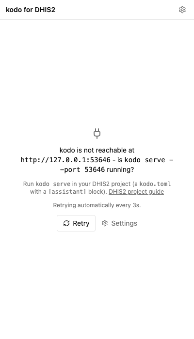

## Backends

The panel can hold several backends at once — a local generic stabbur, a project
assistant, a remote instance — each with its **own base URL, token, and conversation
history**. When more than one is configured, a switcher appears next to the "stabbur"
title in the header; picking one swaps the whole panel (transcript, target banner,
tools) to that backend.

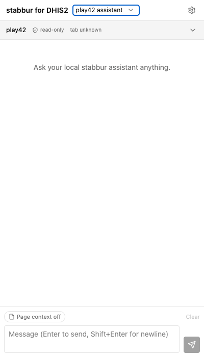

!!! note "The switcher is a native dropdown"
    The switcher is a standard `<select>`; its open list is drawn by the OS, so the
    screenshot shows the control (here set to the `play42 assistant` backend) rather
    than the expanded popup. Both backends are visible in the Settings editor below.

Add, name, and test backends in **Settings** (the gear icon). Each entry has a base
URL, an optional token, and a **Test connection** button that pings `/api/status`.
Loopback hosts (`127.0.0.1` / `localhost`) may use `http`; a **remote** host requires
`https` (an extension page cannot make plain-http requests to a remote origin — a
mixed-content block), and remote stabbur also wants a bearer token (stabbur auto-generates
`auth_token` when it binds a non-loopback interface).

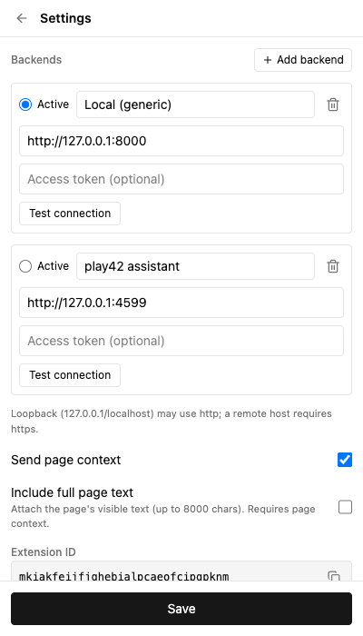

## Chat

Type and send; the reply streams token by token. Along the way:

- **Tool chips** — each tool call and result renders as a compact chip. A structured
  (JSON) result collapses to a one-line digest of its top-level keys; click it to
  expand the pretty-printed payload (the exFAT bridge's `{exit_code, stdout}` envelope
  is inlined so you read the real data, not an escaped string).
- **Reasoning** — a model's thinking stream folds into a collapsible "Reasoning"
  block above the answer.
- **Stop** turns the send button into a stop button mid-stream; aborting leaves the
  partial answer and no error. **Clear** empties the current backend's transcript.

<figure markdown>
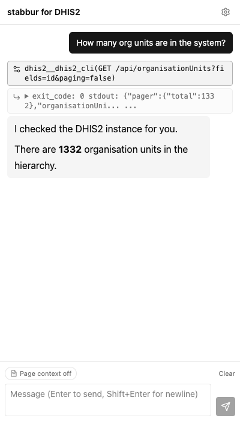
<figcaption>A tool result chip, collapsed to a digest of its top-level keys.</figcaption>
</figure>

<figure markdown>
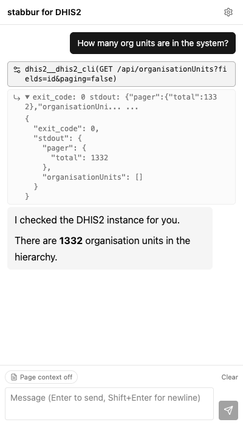
<figcaption>The same chip expanded — the double-encoded stdout is inlined as parsed JSON.</figcaption>
</figure>

### Page context

Two pills in the composer (mirrored as checkboxes in Settings) control what gets
attached to your next message:

- **Page context** attaches a labeled block with the page URL, title, and your current
  text selection.
- **Page text** (a sub-option) also attaches the page's visible text, collapsed and
  truncated to 8000 characters — for whole-page tasks. For selection-grounded tasks
  (Q&A, rewrite, translate), select the paragraph first and leave Page text off so only
  your selection is sent.

For a project assistant with a session probe, the context block also carries two
**explicitly labeled** identities so the model never conflates them — the *Browser
session user* (who is viewing the page, from the probe) and the *Tool account* (the
credentials the tools run as, from the assistant metadata).

See the [prompt catalog](extension-prompts.md) for prompts verified against these
toggles.

## Any page (generic)

None of this is DHIS2-specific. The **generic** build (`.output/chrome-mv3`, branding just
"stabbur") is the same panel with no target banner, no Verify, and no bind — it sits next to
*any* page and answers about it through page context. Ask it to summarize an article, pull
the gist of a feed, or explain a selection, and it grounds the answer in the current tab.

<figure markdown>
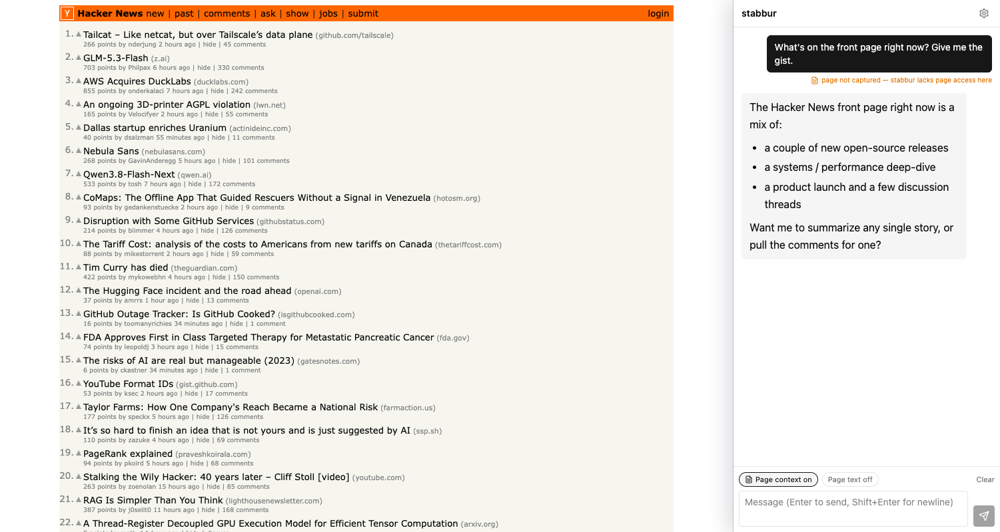
<figcaption>The generic panel next to the Hacker News front page — page context on, no
DHIS2 target or bind, just chat grounded in the page.</figcaption>
</figure>

## Assistant targets

A **project with an `[assistant]` block** (e.g. the `dhis2` template) advertises itself
through `GET /api/assistant`, and the panel renders a **target banner** above the chat:
the assistant name, a read-only badge, its base URL, auth, and source.

<figure markdown>
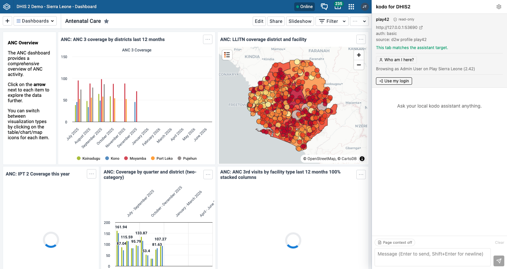
<figcaption>The banner confirms the active tab matches the assistant target, and
<strong>Who am I here?</strong> reports the signed-in user — read same-origin, in the
tab's own context.</figcaption>
</figure>

- **Tab match** — the banner tells you whether your active tab is on the assistant's
  target site ("This tab matches the assistant target.") or not, so you know the page
  context and session reads line up with what the tools act on.
- **Verify** — when the assistant declares a verify recipe, this runs it (a generic MCP
  tool call named in the metadata) and reports the live result.
- **Who am I here?** — when the assistant declares a **probe** recipe, this reads the
  signed-in user on the target tab (same-origin fetches in the tab's own context) and
  shows, e.g., "Browsing as Admin User on Play Sierra Leone (2.42)".

A **generic** backend advertises none of this — no banner, no Verify, no probe — and
chat works exactly the same.

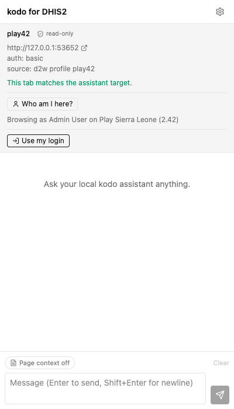

## Use my login

By default a project assistant's tools authenticate as whatever credential the project
was scaffolded with. **Use my login** lets the tools act as *you* on the target
instance instead — without ever copying a password into stabbur.

The button appears once your active tab matches the target. Clicking it shows a consent
card: what will be created, its scope, and its lifetime.

<figure markdown>
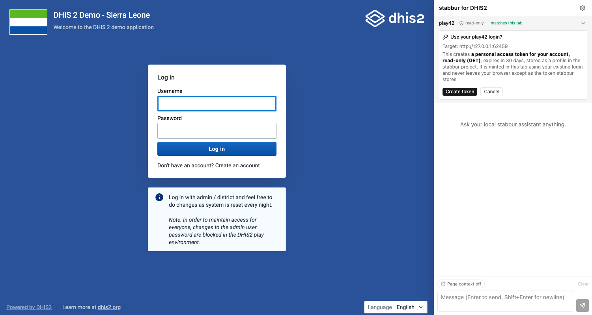
<figcaption>The consent card appears in the panel next to the very instance you are
binding to — read-only (GET), 30-day expiry, minted in the tab's own context.</figcaption>
</figure>

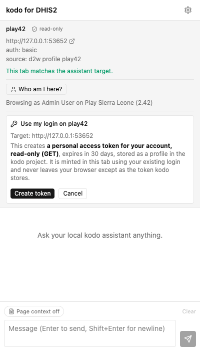

The happy path mints a **personal access token** entirely in the tab's own context
(using your existing login) and hands stabbur only the secret:

1. Log in to the instance in a normal tab.
2. Click **Use my login**, then **Create token** on the consent card.
3. The panel mints a scoped PAT — **GET-only** for a read-only assistant — with a
   30-day expiry, stores it in the sb project's profile, and shows an **Acting as
   \<you\> (your login)** chip.

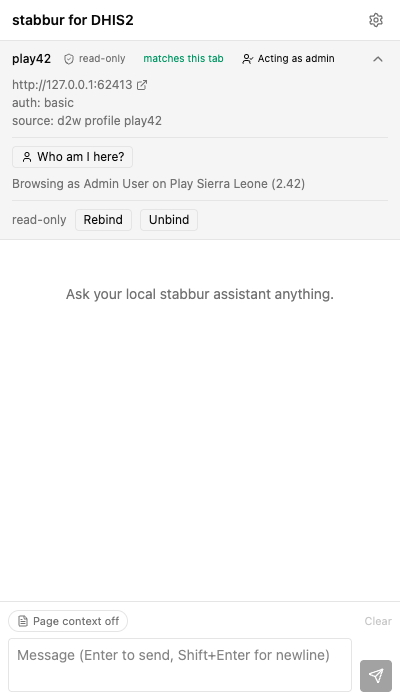

**Read-only by default.** For a read-only assistant the token is minted GET-only. A
write-enabled assistant can instead mint a **read-write** token behind an explicit "Allow
writes" consent — and every write is then gated by a per-action confirmation. See
[Writes, gated](#writes-gated) below.

**Session-cookie fallback.** Some instances won't mint a PAT (older versions, or the
endpoint disabled). The panel then offers to share your **live session cookie** instead
— this asks for the `cookies` permission on the target origin and reads its session
cookie. The trade-offs are real: it **dies when you log out** of the instance, and it
grants the extension cookie access to that origin. The PAT path is preferred; the
fallback is opt-in.

**Expiry, rebind, unbind.**

- The chip flags an **expired** binding (the PAT lapsed, the session cookie was evicted,
  or the tab is now signed in as a different user) and offers **Rebind**.
- **Unbind** removes the bound profile and best-effort revokes the PAT on the instance.
  A PAT is also revocable any time from your DHIS2 user settings.
- Unbinding does **not** restore the assistant's original demo profile. If you want the
  scaffolded credential back, re-copy it (e.g. `cp` the template profile back into the
  project) or rerun the project's profile setup.

## Writes, gated

A **write-enabled** assistant (its `[assistant]` block declares it is not read-only) can
act on the instance, not just read it. Writes are never silent: they are gated in two
places — an up-front consent when you bind, and a per-action confirmation on every single
write.

1. **Bind with writes.** When the assistant is write-enabled, the "Use my login" consent
   card grows an **Allow writes** toggle. Leave it off for a GET-only token (the default);
   turn it on to mint a **read-write** PAT (the full `GET/POST/PUT/PATCH/DELETE` method
   set). The session-cookie fallback is inherently full-authority, so it carries the same
   toggle — there the per-action confirmation is the guardrail, not the token scope.

    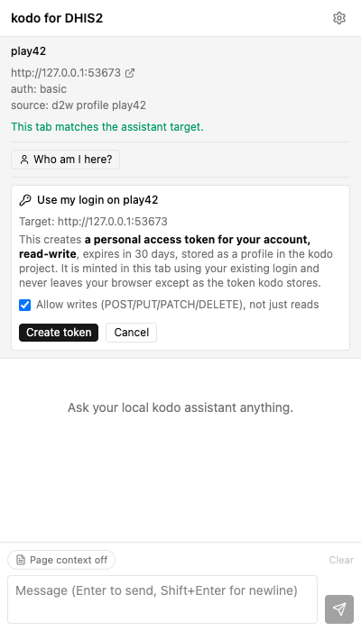

2. **Confirm every write.** When the model calls a write tool, stabbur **holds the call** and
   the panel shows an inline **Approve / Deny** card naming the exact tool and arguments
   (e.g. `dhis2__dhis2_cli(POST /api/dataValues ...)`). Nothing runs until you decide.

    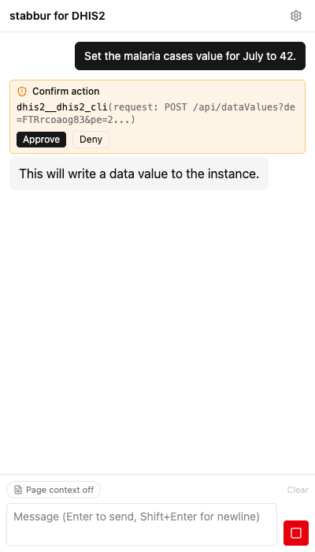

3. **Deny is safe.** Denying returns `error: user declined this action` to the model as the
   tool result; the model reads it and continues (it does not retry blindly). The stream is
   never aborted — approving simply resumes it with the tool's real result.

4. **Fail-safe on timeout.** If a confirmation is left unanswered it **auto-denies** after
   `STABBUR_CONFIRM_TIMEOUT` (300s by default) — the card shows *Auto-denied (timed out)* and
   the model continues as if you had denied it.

    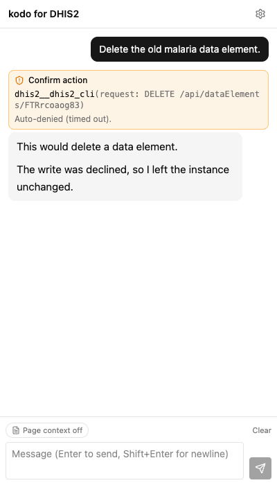

The non-interactive one-shot (`sb chat -p`) has no card to click, so it **fail-safe-denies
every write** unless you pass `--allow-writes` — an explicit opt-in for scripted runs.

## Troubleshooting

| Symptom | Cause & fix |
| --- | --- |
| **403 on load / "cross-site guard"** | The extension origin isn't allowed. Add `cors_origins = ["chrome-extension://<your-id>"]` (the gate and Settings show the exact line) and restart `sb serve`. |
| **401 / token prompt** | The server requires auth. Paste the `auth_token` into Settings (Access token); the panel prompts for it automatically. |
| **Every call 404s** | A trailing slash in the base URL (`.../`) — the panel normalizes it on save, so re-save the backend. |
| **"No model is loaded" / stuck loading** | A locked project has a model but it isn't running: click **Load \<model\>**. A cold start can take a while (a `409`/loading state is expected); it flips to ready on the next status poll. |
| **Binding suddenly "expired"** | The target instance rotated or reset (e.g. the DHIS2 **play** demo resets nightly), invalidating the PAT/session. Just **Rebind**. |
| **Remote stabbur won't connect** | A non-loopback base URL must be `https` (mixed-content block). Serve stabbur behind TLS or tunnel to `127.0.0.1`. |

---

!!! info "Regenerating the screenshots"
    The panel-detail images (`NN-*.png`, `01`-`11`) are generated headlessly against mock
    backends (no real `sb serve`, ephemeral ports, a pinned light-theme viewport) using
    the DHIS2-flavored build. `09`-`11` cover the write flow: the "Allow writes" bind
    consent, the mid-chat Approve/Deny confirmation card (pending), and the same card
    auto-denied on timeout. The **hero composites** (`hero-*.png`) join two real
    screenshots side by side; `hero-1`-`hero-3` pair the live play42 UI with the panel
    (its target banner and Who-am-I run against the real logged-in play42 tab, a mock stabbur
    backend with the real probe recipe — if play42 is unreachable the page half falls back
    to a mock target). `hero-4-generic` pairs the **generic** build's panel with the
    Hacker News front page (a local stand-in if Hacker News is unreachable).

    ```bash
    cd extension && bun run screenshots
    ```

    The script is `extension/e2e/screenshots.ts`; it writes `docs/img/extension/NN-*.png`
    and `docs/img/extension/hero-*.png`.
