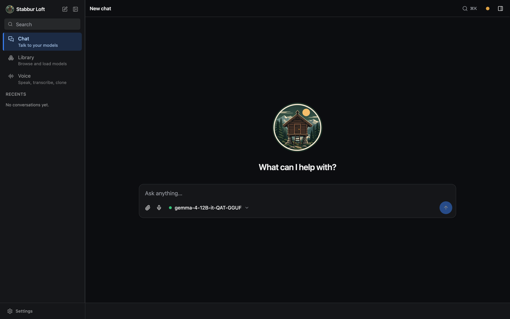

# Web UI (`serve --ui`)

`stabbur serve` runs the FastAPI app: a browse API, an OpenAI `/v1` proxy to the
loaded model, plus `/v1/audio/*` for speech, and — with `--ui` — the browser
single-page app (React/Vite + Tailwind).

To call that API from your own code rather than the browser, see
[Using stabbur's API](api.md).



## The model landscape

stabbur runs two families of models — keep them distinct:

- **Chat** — **language models you talk to**: text in, text out. Some also *read*
  other input (a **vision** model sees images; an **audio** model hears speech) and
  some **call tools** — but their job is generating a text reply. These load into the
  runtime (`llama-server` / `mlx_lm`) one at a time.
- **Voice** — **audio in/out, not chat**: **TTS** turns text into speech (Kokoro,
  Dia, …), **STT** transcribes speech into text (Whisper). These run *on demand* per
  request; they're never "loaded" into the chat runtime. See the
  [Voice guide](voice.md).

A chat model that *reads* audio is not a voice model — it hears you and answers in
text; it never speaks (that's TTS) and transcription is STT's job.

## Surfaces

Three surfaces, reachable from the sidebar (or the collapsed icon rail):

- **Chat** — the conversation: pick a chat model in the composer and talk to it
  (New chat + your recent conversations).
- **Voice** — the TTS/STT studio (generate speech, clone a voice, transcribe).
- **Library** — browse **every** model, in **Chat** and **Voice** categories: load
  a chat model, tag/filter, and see each voice model's card.

## Features

- **Model picker** (in the Chat composer) — grouped by format, with per-model
  **capability icons** (tools · vision · audio), a rich hover tooltip
  (format/size/context/caps), **filter chips**, and an **eject** action. Hidden when
  the server is **locked** (a project assistant, or `--model`) — the top-bar badge
  then shows the bound model.
- **Tools** — a per-server fly-out menu with a master switch, per-server
  toggle-all, and per-tool switches (scales from 3 tools to hundreds).
- **Multimodal input** — for vision/audio models, attach **images** and **audio**
  via drag-drop, paste, or the picker, or **record from the mic** (auto-stops on
  silence). Images open fullscreen on click; audio plays inline. stabbur nudges you
  toward an audio-specialist model when one fits better.
- **Text / document attachments** — drop, paste, or pick **text/code files**
  (`.md`, `.py`, `.json`, `.csv`, …) with **any** model: their contents are inlined
  into the prompt as fenced blocks (the message shows a filename chip, not the raw
  text), so a plain chat model can read a file as context.
- **Listen (text-to-speech)** — a speaker button on each reply reads it aloud
  (Markdown/code is stripped first so only the prose is spoken); the settings rail
  picks the **voice** — a picker of Kokoro's **54 built-in voices** across 9 languages
  (grouped by language), since Kokoro ships built in. `llama-tts`/OuteTTS is available
  as an alternate engine.
- **Mermaid diagrams** — ```` ```mermaid ```` fenced blocks render as live
  diagrams (theme-aware, lazy-loaded), with a source/diagram toggle and copy;
  invalid syntax falls back to the source.
- **Export** — a download menu in the top bar exports the open conversation as
  **Markdown** (source-form: roles, code fences, reasoning, tool activity, and a
  model + params header) or **PDF** (a styled, self-contained document opened in a
  print window for "Save as PDF"; mermaid diagrams are rendered to inline SVG).
  Both run client-side from conversation state.
- **Settings rail** — system prompt (a new chat uses the **project default**
  from `stabbur.toml`; type to override, or clear it to send no system prompt),
  sampling (with model-recommended defaults shown), and **context length**
  (presets + custom; reloads the model). Settings are **per conversation**, so
  each chat starts fresh.
- **System health** — a status dot opening the same checks as `stabbur doctor`.

**Build the UI once** (it's not committed — only its source is):

```bash
make frontend                         # bun install + build → frontend/dist
```

Then serve it:

```bash
stabbur serve --ui                       # browse + chat in the browser, switch models
stabbur serve --ui --port 2222           # pin the port for a stable URL/bookmark
stabbur serve --ui --model <name>        # locked to one model (extension backend)
```

For UI development, `make frontend-dev` runs Vite with hot reload (it proxies
`/api` + `/v1` to `STABBUR_DEV_API` or `:2222`, so a plain `stabbur serve` (which binds 2222)
alongside).

By default `serve` **auto-picks a free port** and prints the URL on startup, so it
never collides with your other services. Pass `--port` (or set `STABBUR_PORT` /
`port` in `stabbur.toml`) to pin a stable address — useful for a browser bookmark or
the Chrome-extension origin. `--host` overrides the bind address.

The SPA (built to `frontend/dist`) is served via FastAPI's first-party
`app.frontend()` with `fallback="index.html"`, so client-side routes resolve to
the SPA while API path operations still match first. If it isn't built yet, the
API still runs and `serve --ui` says so.

## Single-origin proxy

The app keeps one stable origin while swapping the underlying runtime:

| Endpoint | Purpose |
| -------- | ------- |
| `GET /api/status` | runtime state (`stopped`/`loading`/`ready`), model, n_ctx, error |
| `GET /api/library` | runnable **chat** models + capabilities (vision/audio/tools/context) |
| `GET /api/voice` | **voice** models (TTS/STT) with backend + traits, for the Library/studio |
| `GET /api/model?name=` | one model's card + metadata + recommended sampling |
| `POST /api/load/{name}` | load/switch a model (`?n_ctx=` sets context; locked → 409) |
| `POST /api/unload` | eject the loaded model (frees memory) |
| `POST /api/chat` | server-side agent loop (tools + multimodal) → typed SSE |
| `GET /api/tools` | attached MCP tools (namespaced `<server>__<tool>`) |
| `GET /api/assistant` | project `[assistant]` target metadata for UI clients (404 if none); `?verify=1` runs the verify recipe |
| `POST /api/assistant/bind`, `/unbind` | install/remove a client-minted credential (the side panel's "Use my login") |
| `GET /api/doctor` | system-health report (mirrors `stabbur doctor`) |
| `GET /api/voices`, `POST /api/speak` | list voices (Kokoro + OuteTTS); synthesize text → WAV (chat Listen) |
| `POST /v1/audio/speech` | OpenAI TTS: text → audio (Kokoro/Dia/…), formats via ffmpeg, voice cloning |
| `POST /v1/audio/transcriptions` | OpenAI STT: audio → text (Whisper) |
| `POST /v1/{path}` | stream-proxied to the loaded runtime's `/v1` |
| `GET /health`, `GET /docs` | health check, OpenAPI docs |

So the SPA only ever talks to `serve`'s origin; `serve` starts `llama-server` /
`mlx_lm.server` on an internal port (auto-picked free by default; pin it with
`runtime_port` / `--runtime-port`) and proxies to it.

## Locked single-model mode

```bash
stabbur serve --ui --model <name>        # or: make run MODEL=<name>
```

Locks the server to one model: no switching, the composer's model picker is hidden
(the top-bar badge shows the bound model), and a stable `/v1`. This is the backend for the
[Chrome side panel](extension.md), whose panel points at this endpoint. Set `cors_origins`
to the extension's origin so it can call across origins (see below).

**A project locks too.** In a directory with a `stabbur.toml` whose `[project].model`
is set, `stabbur serve` binds to that model the same way (a project is a purpose-built
assistant: model + system prompt + tools). Working **without** a project is free-play
— pick and switch any chat model. An explicit `--model` overrides a project.

## Cross-origin access

By default the server is **same-origin only**: the web UI is served by this same
app so it needs no CORS, and mutating `/api` / `/v1` calls that a browser marks
**cross-site** (via `Sec-Fetch-Site`) are rejected with `403`. This stops a random
website you visit from driving your local models or MCP tools from the browser
(even a no-preflight "simple" request can execute server-side otherwise). Non-browser
clients (curl, the CLI) and same-origin requests are unaffected.

To allow a real cross-origin caller (the Chrome extension, or a separate dev
server), list its origin in `cors_origins` (`stabbur.toml` or `STABBUR_CORS_ORIGINS`) —
that both enables CORS for it and exempts it from the cross-site guard. `["*"]`
re-opens it to everything; avoid that outside throwaway local testing.
