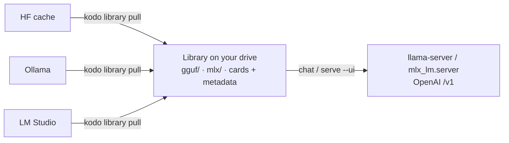

# kodo

Build a **full local library of LLM models**, then **run, chat, and serve** them
— entirely on your own hardware. Discover models from Hugging Face, Ollama, and
LM Studio, pull them into one library on a drive of your choosing, and serve any
of them through an OpenAI-compatible API and a browser chat UI.




!!! info "Proprietary, source-available"
    kodo is **not** open-source. Copyright (c) 2026 Morten Hansen, all rights reserved
    (see [`LICENSE`](https://github.com/winterop-com/kodo/blob/main/LICENSE)). The source is
    published for reference and evaluation; running it requires a written license — contact
    **<morten@winterop.com>**. Install is from source with `uv` (there is no `pip install kodo`);
    see [Getting started](getting-started.md).

## Why

- **One library, everywhere.** A single, format-organized library on an external
  or cloud drive — move it by changing one setting.
- **Run anything, uniformly.** GGUF via llama.cpp, MLX via `mlx_lm` — both behind
  one OpenAI-compatible endpoint, so any client attaches the same way.
- **Local and private.** Nothing leaves the box. Built to pair with tool/MCP use
  by small local models.

## Quick taste

```bash
uv sync
kodo library ls                       # your library (the models on your drive)
kodo library sources                    # models in app caches you could pull
kodo library pull lmstudio <name>       # pull one into the library (--move to relocate)
kodo serve --ui                 # browse + chat in the browser
kodo chat <name> -p "hello"     # one-shot, scriptable answer
make run MODEL=<name>           # backend + browser UI, locked to one model
```

Start at [Getting started](getting-started.md), or jump to the
[CLI reference](cli.md).

## The name

**kodo** is short, easy to type as a command, and deliberately *neutral* — it
collides with nothing (no PyPI package, no product, no brand), which is the
safest kind of name. If you want a meaning, read it as 鼓動 (*kodō*) — Japanese
for **heartbeat / pulse**: the steady pulse of your own models, running on your
own hardware.
