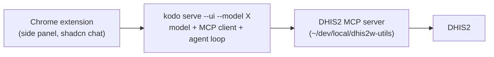

# Roadmap

## North-star

A **local, self-hosted DHIS2 assistant** — your own model + DHIS2 tools in a
browser side panel:

The DHIS2 MCP side already exists in `dhis2w-utils`, with servers built for small
local models:

- **`dhis2w-mcp-bridge`** — one tool (`dhis2_cli`) shelling out to `d2w`, with
  progressive `--help` discovery; fits an 8k-context model. The default target.
- **`dhis2w-mcp-router`** — two meta-tools (`search_tools`/`call_tool`), lazy
  typed discovery, a single guarded chokepoint with a **read-only mode** that
  gates DHIS2 writes.
- **`dhis2w-mcp`** — the full ~304 typed tools (for big-context hosts).
- `dhis2w-browser` — Playwright DHIS2 automation (for later "act on the page").

## Phases

1. **Phase 1 — kodo + web chat UI** (in progress). Library, pull/run/chat,
   `serve --ui` + locked mode, the `/v1` proxy, and **generic tool/MCP support**
   (agent loop + MCP client pointable at any MCP server; tool activity rendered
   in the chat).
2. **Phase 2 — DHIS2 + Chrome extension.** Point the MCP client at
   `dhis2w-mcp-bridge`/`-router`; ship the chat UI as the side-panel extension
   against the locked `/v1`.
3. **Later** — extension page-context, then page-actions via `dhis2w-browser`.

## Projects (assistant definitions)

Two distinct units:

- **Library** — the *global* model store on the drive (`KODO_BACKUP_ROOT`):
  machine/checkout-independent, idempotent, never in the cwd.
- **Project** — a *local* (cwd) definition of an **assistant**: a thin
  `kodo.toml` pointing at a library model + a list of MCP servers + a system
  prompt + serve/UI settings. Versionable and shareable.

This makes assistants **reproducible**: the north-star DHIS2 assistant is just a
project — `gemma-4-12B-it-QAT` + `dhis2w-mcp-bridge` + a DHIS2 prompt +
locked-serve config. `git clone` it → `kodo init` ensures its model is in your
library → `kodo serve --ui` (or the extension) runs it.

Keep the project file a **manifest, not a framework**: it references a library
model and tools; the library + runtime do the work. In a project dir, `kodo run` /
`serve` use that project's model, MCP servers, and prompt.

## Curated starter models (folded into `kodo init`)

`kodo init` scaffolds a project (above) and, as part of it, ensures the project's
model is in the library. When you don't yet know what to pick, it offers a small
**curated set of 2–3 models** — kept deliberately tiny, e.g. a compact GGUF for
any machine, an MLX build for Apple Silicon, and a tool-capable model for the
agent/MCP path — and pulls the chosen one. So init = scaffold + ensure-model in
one on-ramp.

- The curated list lives in-repo (versioned), so "what's worth trying" travels
  with the project and stays current.
- `kodo init` is the zero-to-chatting on-ramp: clone → `kodo init` → `kodo run`.
- Just 2–3 entries, clearly labelled by use case and footprint, quick to pull.
- **Idempotent by design:** `init` checks the **library** for each curated model
  and pulls only what's missing — run it any number of times, no double
  downloads. No "already ran" flag in the cwd (the checkout isn't the library)
  and none in `~/.config` (per-machine would desync from a shared drive). Any
  optional first-run marker belongs in the **library root**
  (`<backup_root>/.kodo/`), which travels with the drive. `--force` re-offers.

## Discovering models (`kodo search`)

`kodo sources` shows what's already in your local app caches; `kodo search
<query>` will find **new** models to pull — querying the Hugging Face Hub
(filtered to GGUF/MLX, sortable by downloads/likes/size) and surfacing results you
can `kodo pull` directly. Closes the loop: discover → pull → run, without leaving
the CLI.

## One SPA, many surfaces

The chat UI is built once and wrapped:

- **Web** — `serve --ui` serves `frontend/dist`.
- **Chrome extension** — MV3 side panel loads the same bundle (locked `/v1`).
- **Desktop** — Tauri + Electron wrappers, following maneki's
  `desktop/{tauri,electron,react}` pattern (parallel wrappers, one shared SPA);
  ideally the desktop app also launches `kodo serve` for one-click use.

## UI stack

Vite + React + Tailwind v4 + **shadcn/ui**, using shadcn's official chat
components (`MessageScroller`, `Message`, `Bubble`, `Attachment`, `Marker`) with a
hand-rolled OpenAI SSE loop — the backends emit raw OpenAI SSE, so we avoid the
Vercel AI SDK stream-format mismatch.
